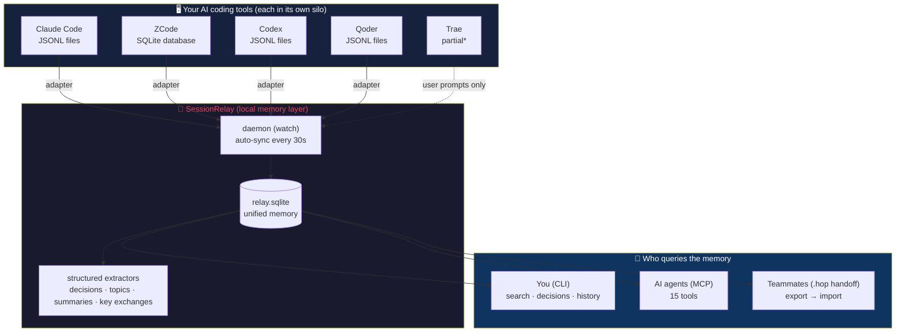
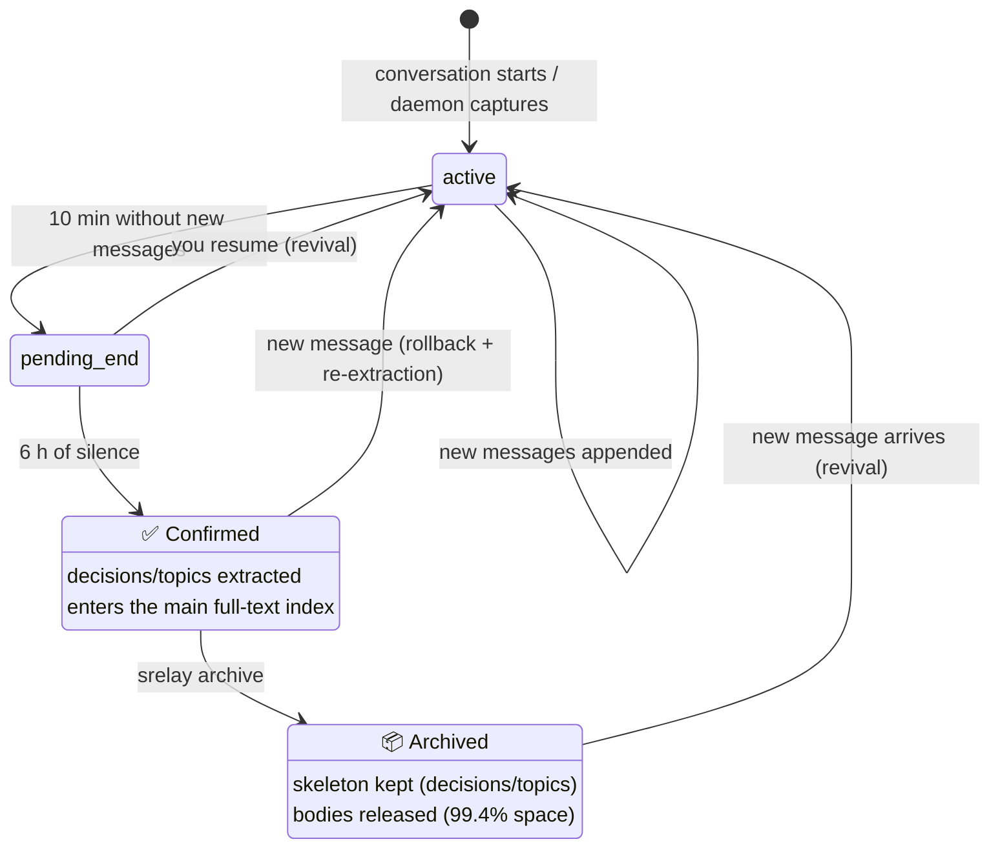
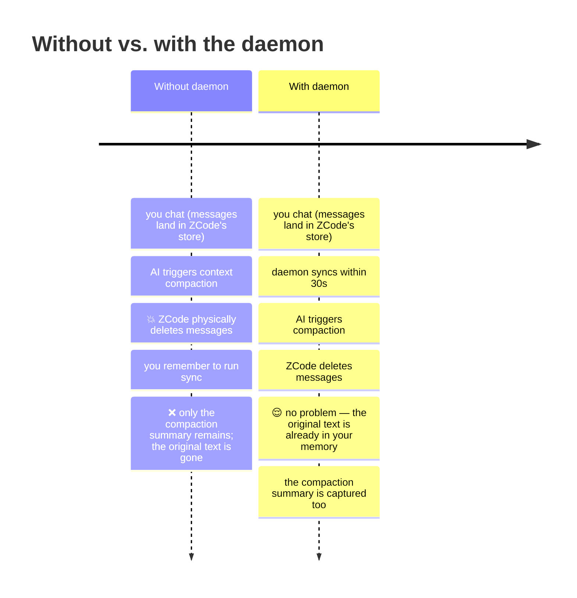

# SessionRelay 会话接力

> **A local memory layer that belongs to your project — not to any vendor.**
> Memory is always complete. Retrieval is always yours to shape.

You spent three days settling an architecture with your AI. That shouldn't vanish when the window closes. It belongs to the project — and to whoever picks it up next.

> 📖 中文文档：[README.md](./README.md)

## What it solves

| Pain point | SessionRelay's answer |
| ---------- | --------------------- |
| **Amnesia across time**: you ask a new session "what did we decide last week?" — the AI has no idea | Search historical sessions on demand, with mandatory provenance |
| **Fragmentation across tools**: the plan was settled in Claude Code; ZCode knows nothing | Multi-source, one database — any agent queries the same memory via MCP |
| **Handoff across people**: you spent 3 days with your AI; your teammate inherits "go read the code" | Export a `.hop` handoff package — their AI instantly owns the full context |

## The architectural difference vs. claude-mem: session-level storage

This is the core design decision — not a feature difference, a **storage-granularity** difference:

| | Fragment memory (claude-mem style) | **SessionRelay** |
| -- | ---------------------------------- | ---------------- |
| Unit of storage | compressed shards, mixed across sessions | **complete sessions** (title / timeline / source / status / decisions) |
| What the AI sees | "you once said..." shards | "ZCode session *Database Selection*, Aug 20, message 12..." |
| Hallucination risk | high: context pollution + compression distortion + no provenance | **structurally suppressed**: mandatory provenance + on-demand queries + jump back to the original text |

Three anti-hallucination commitments (architecture, not features):

1. **Mandatory provenance** — every answer must cite which session, which message, which tool. Traceable sources leave no room for confident guessing.
2. **Pull, not push** — the AI queries only when needed. Clean context, no ambient memory pollution.
3. **Original text, always** — the AI gets the full raw conversation, not a pre-chewed summary. The "why" survives.

## Architecture overview

Everything you discuss with any AI tool flows into one project-level database; you, your AI, and your teammates can all query it. Switch tools without losing memory. Switch people without losing context.



> \* Trae encrypts assistant replies end-to-end; only user prompts are readable. Tool not on the list? Write a [custom adapter](docs/adapters/README.md) — zero core changes.

## Memory lifecycle

Every session passes through a two-phase verdict. **Better to wait than to crystallize an unfinished conversation:**



**Why the pending stage exists**: conversations resurrect (you `--resume` the next morning). Crystallize too early and the extracted decisions are incomplete. Pending is a 6-hour buffer; even after confirmation, appended messages trigger a rollback and re-extraction. Raw session files remain the single source of truth — the database can always be rebuilt with `srelay rebuild`.

## Core capabilities

### 🖥️ Passive capture (zero friction)
- **Five-source adapters**: Claude Code · ZCode · Codex · Qoder (full) + Trae (partial: user prompts only) + [custom adapters](docs/adapters/README.md) (drop in one JS file, zero core changes)
- **Three privacy modes**: `full` (default) / `meta` (metadata only) / `off` (manual only)
- **`.sessionrelayignore` hard boundary**: privacy exclusions apply to auto-capture, manual `save`, and export alike
- **Two-phase verdict**: `active → pending_end → confirmed`, auto-rollback on resume; raw session files are the single source of truth (the DB is always `rebuild`able)
- **Backfill**: `srelay init` backfills the last 30 days by default; `srelay sync --backfill all` imports your full history

### 🔍 Chinese-optimized search
- jieba tokenization + SQLite FTS5 dual indexes (gated by six Chinese acceptance cases)
- Session-level AND coverage with OR fallback: compound words split ("认证方案" → 认证 + 方案), quoted phrases match exactly (`"按月分区"`)
- Every result **carries a mandatory provenance block** (session ID / source tool / date / message numbers / snippet)

### 🤖 MCP Server (15 tools: 8 read + 7 write-domain)
Once your AI agent connects via MCP, it stops being amnesiac in this project:

<details>
<summary><b>8 read tools</b> — questions your AI can finally answer</summary>

| Tool | Question it answers |
| ---- | ------------------- |
| `search_sessions` | "Did we ever discuss X?" (Chinese/English full-text + metadata filters) |
| `get_session_detail` | "What exactly did we say?" (full messages, ranged, role-filtered) |
| `list_sessions` | "What topics has this project covered?" |
| `get_decisions` | "Why X instead of Y?" (all confirmed decisions, with provenance) |
| `get_file_history` | "Why is this file written this way?" (cross-session file discussion history) |
| `get_unresolved` | "What's still undecided?" (open questions) |
| `get_stats` | "How big is the memory?" (sessions/sources/size) |
| `set_scope` | Retrieval-boundary escape hatch |

</details>

<details>
<summary><b>7 write-domain tools</b> — the AI is no longer just a reader</summary>

| Tool | Capability | Safety boundary |
| ---- | ---------- | --------------- |
| `annotate_session` | tag sessions / write human summaries | metadata only, never rewrites conversations |
| `save_note` | AI records conclusions as notes (decision phrasing enters the decision library) | `source=note`, identifiable and auditable |
| `export_handoff` | produce a .hop handoff package | read-only export |
| `import_handoff` | import a package (sha256 verified + normalized) | **quarantine by default** (bodies pending release) |
| `release_quarantine` | release quarantined message bodies | explicit call required |
| `link_sessions` | relate sessions (continues/related/pinned) | links are queryable and revocable |
| `get_linked_sessions` | bidirectional link queries | read-only |

</details>

**Write-domain principles (D21)**: bypass the write path (never touches the state machine) · import defaults to quarantine · notes are traceable — every AI write is identifiable, auditable, revocable.

### 🎯 Scope: retrieval boundaries
- **Tier B**: `scope.json` project contract (shared by CLI and MCP), intersection semantics — can only narrow
- **Tier A**: auto-scope backstop (MCP-side, recent-30-days configurable) against context pollution
- **attach**: mount specific historical sessions before starting new work (highest-priority predicate)
- **Hot reload**: scope changes take effect on the next call

### 📦 HOP handoff protocol (`hop/1.0`, open format)
- [Standalone protocol spec](spec/hop-1.0.md) (MIT, vendor-neutral, third-party readers welcome)
- Per-file sha256 integrity (any tampering rejects the whole package)
- **Default secret redaction**: AWS keys / private keys / Bearer tokens / password assignments / DB connection strings, with a redaction report
- **Quarantined import**: metadata and summaries first; bodies released one by one — a structural defense against prompt injection
- HANDOFF.md generated automatically (decision table / files involved / open questions / timeline / signature footer)
- **Cross-project import**: packages land in any project path or name (auto-normalized, `origin_project` kept for provenance)

## Quick start

Requires **Node ≥ 22** (Windows / macOS / Linux):

```bash
# Option 1: npm (recommended)
npm install -g @ewanjasper/sessionrelay

# Option 2: zero-install trial
npx @ewanjasper/sessionrelay init

# Option 3: from source
git clone https://github.com/EwanJasper/SessionRelay.git
cd SessionRelay && npm install && npm run build && npm link
```

### Initialize a project

```bash
cd your-project
srelay init                  # initialize + backfill last 30 days (last month searchable within a minute)
srelay sync --backfill all   # or backfill your entire history (old sessions auto-confirm + extract decisions)
```

### Daily use

```bash
srelay search 中文关键词 [--topic --source --since --json]
srelay decisions         # all confirmed decisions, with provenance
srelay history src/db/   # which sessions discussed this file
srelay watch --install-service  # register the daemon (Windows), starts at login
srelay doctor            # environment self-check
```

### Team handoff

```bash
srelay export --all      # handoff package (redacted by default) → send to a teammate
# The teammate, in any project root:
srelay import xxx.hop --from your-name
```

👉 Full walkthrough (five scenarios: project handoff / onboarding / safe import / cross-project migration / periodic archiving): [Import & Export Guide](docs/import-export-guide.md)

## ⚠️ Why the daemon is not optional

**ZCode physically deletes old messages on context compaction** (measured: one compaction deleted 3,976 messages from a long session). The daemon syncs every 30 seconds so messages land in the database before deletion.

Without the daemon: anything the AI compacts between two manual syncs is **permanently lost**.

```bash
srelay watch --install-service   # Windows registry autostart (no admin required)
srelay watch --foreground        # macOS/Linux foreground (service registration in progress)
```

Daemon overhead: ~0% idle CPU (event-driven), ~80MB memory (resident Node.js), negligible incremental disk I/O, **zero network calls**.



## MCP integration

### Claude Code (one command)

```bash
claude mcp add sessionrelay --scope user -- srelay serve
```

Run `/mcp` in Claude Code — `sessionrelay` should show as connected with 15 tools ready.

### ZCode / other MCP clients

Add to your project's MCP config (`.mcp.json` or client settings):

```json
{
  "mcpServers": {
    "sessionrelay": { "command": "srelay", "args": ["serve"] }
  }
}
```

### Most robust fallback (any MCP client, bypasses PATH issues)

```json
{
  "mcpServers": {
    "sessionrelay": {
      "command": "node",
      "args": ["/your/install/path/SessionRelay/dist/srelay.js", "serve"],
      "env": { "SRELAY_PROJECT_ROOT": "/your/project/path" }
    }
  }
}
```

### How to verify it works

Open a fresh AI session and ask:

> **"Why did we decide on PostgreSQL?"**

Correct behavior: the AI calls `get_decisions` or `search_sessions` and answers with provenance (date, source tool, session ID, message numbers). If it says "I don't know," MCP isn't connected — run `srelay doctor`.

### Context safety (the AI never "eats too much")

- `get_session_detail` defaults to 20 messages × 1,000 chars ≈ 20KB, hard-capped at 50KB
- When truncated, responses carry `truncated: true` plus actionable hints (`role="user"` to see only your prompts / `get_decisions()` for conclusions / paginate)
- More requires explicit parameters — safe by default, no trust in model restraint

### Claude Code lifecycle hook (optional, speeds up session confirmation)

```json
{
  "hooks": {
    "Stop": [{ "hooks": [{ "type": "command", "command": "srelay hook session-end --id $CLAUDE_SESSION_ID" }] }]
  }
}
```

## Custom adapters (adding a new agent)

SessionRelay's adapters are pluggable — **adding a new AI tool = zero core changes**:

```
.sessionrelay/adapters/my-agent.js   ← just drop in a JS file
```

```javascript
// minimal implementation
module.exports = {
  id: 'my-agent',
  displayName: 'My Agent',
  discover(projectRoot, config) {
    // return the sessions belonging to this project
    return [{ source: 'my-agent', sourceSessionId: 'xxx', sourceFile: '...', sizeBytes: 1024, mtimeMs: Date.now() }];
  },
  async readNew(ds, cursor, config) {
    // incrementally read new messages (the cursor is your own watermark object)
    return { messages: [{ role: 'user', content: '...', seqNum: 1 }], badLines: 0, cursor: { offset: 100 } };
  },
};
```

Full interface and more capabilities (watchRoots / healthCheck / detectCompaction) in the [Adapter SDK docs](docs/adapters/README.md).

## Privacy design

- **Local-first**: zero cloud dependencies, zero runtime network calls (telemetry = a local counter + voluntary submission)
- **Three capture modes** + **ignore hard boundary** + **redacted-by-default export** + **quarantined import** — four lines of defense
- **Trust model**: handoff contents are data, not instructions — written into the `hop/1.0` protocol

## Quality & verification

- **125 tests** (unit / integration / MCP stdio real-handshake contract / end-to-end), one `npm test`
- **CI green across 3 platforms × Node 22/24** (typecheck + test + build + dist smoke)
- TypeScript strict, `npm run typecheck` clean
- Real-machine acceptance at every phase (including the product recording its own birth)

## Known limitations (honest list)

- Rule-based extraction precision is ~60-70% (provenance blocks let you verify item by item; `--ai` enhancement is Phase 4)
- Daemon service registration is Windows-only (registry run key); macOS / Linux run `srelay watch` in the foreground
- "Auto-attach important sessions to new ones" needs session identity (branch/PID), landing in Phase 4; for now use manual `attach`
- Concurrent multi-agent sessions on one project scope by project+cwd
- Historical sessions under renamed/moved directories are not auto-discovered (use a handoff package to migrate)
- Trae is partial only: user prompts are readable, assistant replies are end-to-end encrypted (use `save_note` to record conclusions)
- DSH / Cursor and other tools are on the roadmap ([custom adapters](docs/adapters/README.md) work today)

## Roadmap (Phase 4)

`--ai` summary/extraction enhancement · session identity (branch/PID) and auto-attach · `suggest_related_sessions` (topic-overlap recommendations) · official DSH / Cursor adapters · macOS/Linux daemon service registration · semantic search (optional local embeddings) · third-party adoption of the HOP protocol

## Documentation

- **[User Guide](docs/user-guide.md)** (Chinese) — the complete manual from install to team handoff
- [Import & Export Guide](docs/import-export-guide.md) (Chinese) — five scenarios with complete commands
- [Adapter SDK](docs/adapters/README.md) — how to write a custom adapter (7 lines of code per new AI tool)
- [HOP handoff protocol spec, hop/1.0](spec/hop-1.0.md) — open format, MIT
- [Privacy & data lifecycle](docs/privacy-and-lifecycle-design.md) (Chinese) — the three-layer privacy model
- Design decision logs (Chinese, contributor-facing): see [CONTRIBUTING.md](CONTRIBUTING.md)

## License

MIT © 2026 EwanJasper
