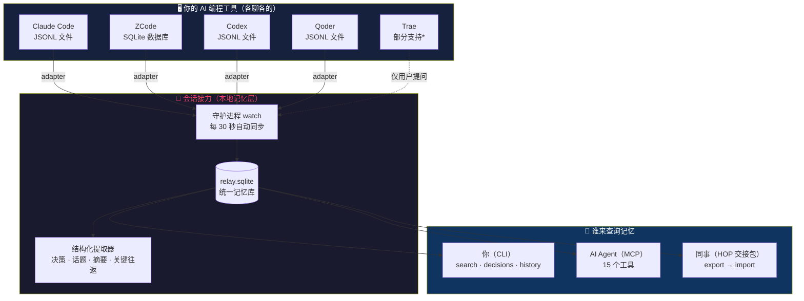
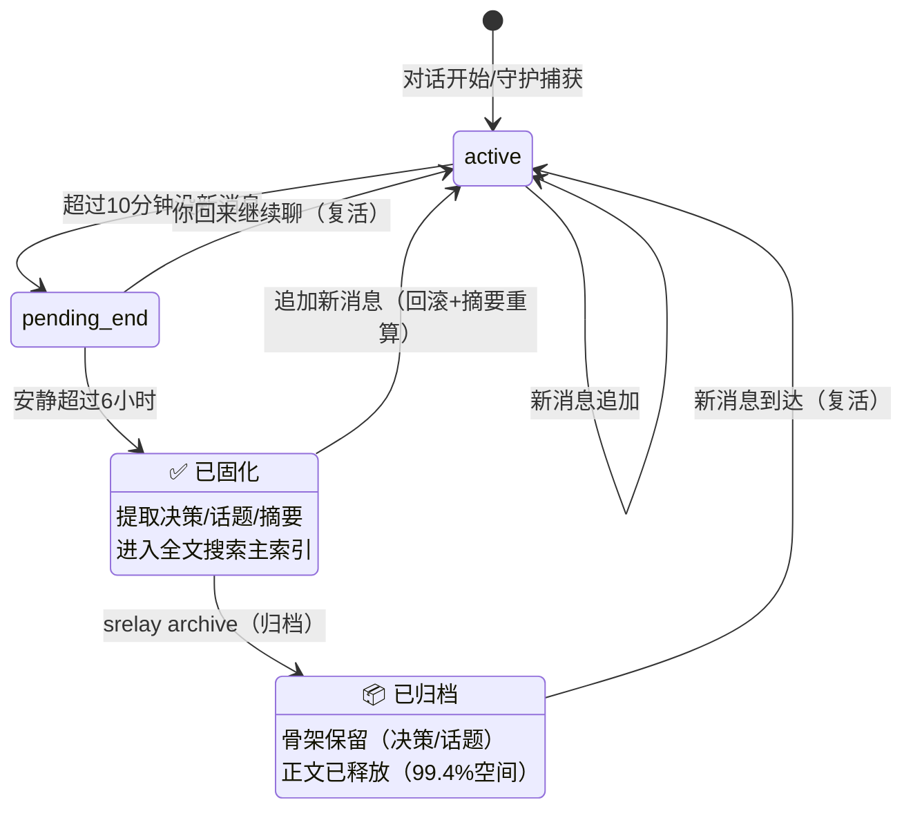
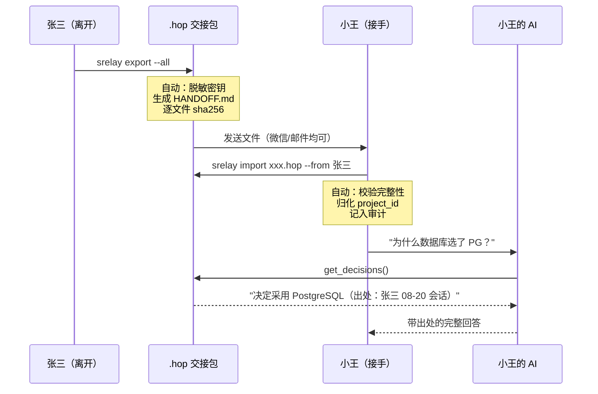
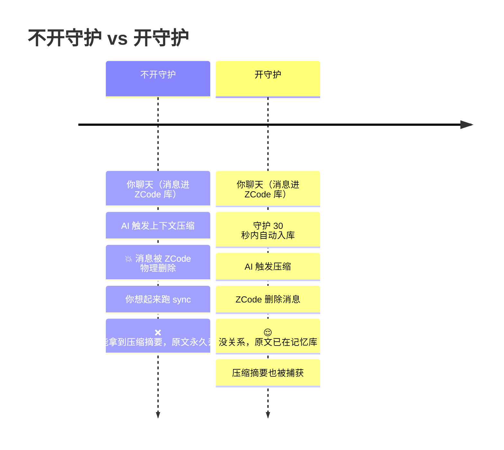

# 会话接力 SessionRelay

简体中文 | [English](./README.en.md)

> **属于项目、不属于任何厂商的本地记忆层。**
> Memory is always complete. Retrieval is always yours to shape.
> 记忆始终完整收录；检索边界由你划定。

你和 AI 聊了 3 天的方案，不应该随关窗消失。它属于项目，属于下一个接手的人。

## 60 秒演示

<!-- ▶ 内嵌播放器设置（一次性，约 10 秒）：在 GitHub 网页端编辑本文件，将 sessionrelay-final.mp4 拖入到下方"中文版"标题下，会自动插入一行 user-attachments 链接并渲染成原生播放器；英文版同理拖入 sessionrelay-en.mp4。完成后删除本注释和两条 ▶ 文字链接 -->

**中文版**

[▶ 在浏览器中播放（66 秒）](https://github.com/EwanJasper/SessionRelay/releases/download/v0.2.2/sessionrelay-final.mp4)

**English version**

[▶ Play in browser (66s)](https://github.com/EwanJasper/SessionRelay/releases/download/v0.2.2/sessionrelay-en.mp4)

竖版（手机/短视频平台）与女声版：[Releases · v0.2.2](https://github.com/EwanJasper/SessionRelay/releases/tag/v0.2.2)

## 它解决什么

| 痛点 | 会话接力的答案 |
| ---- | -------------- |
| **跨时间失忆**：新会话问"上周讨论的方案？"——AI 不知道 | 按需检索历史会话，带出处 |
| **跨工具断裂**：Claude Code 定的方案，ZCode 不知道 | 双源同库，任何 agent 通过 MCP 查同一份记忆 |
| **跨人交接**：你和 AI 聊了 3 天，接手的人只能"去看代码" | 导出 `.hop` 交接包，对方的 AI 立刻拥有全部上下文 |

## 与 claude-mem 的架构区别：会话级存储

这是最核心的设计决策，不是功能差异，是**存储粒度**的架构差异：

| | claude-mem | **SessionRelay** |
| -- | ---------- | ---------------- |
| 存储单位 | 记忆片段（压缩摘要，跨会话打散混合） | **会话**（完整对话，有标题/时间线/来源/状态/决策） |
| AI 看到的 | 一堆"你之前说过…"碎片 | "根据 8 月 28 日 ZCode 会话《数据库选型》第 12 条…" |
| 幻觉风险 | 高：上下文污染 + 压缩失真 + 无法溯源 | **结构性抑制**：出处强制 + 按需查询 + 原文可回跳 |

三个反幻觉设计（不是功能，是架构承诺）：

1. **出处强制**：AI 回答必须带"哪个会话/哪条消息/哪个 agent"——有源可查，不能瞎编
2. **按需查询**（pull）：AI 不问就不查 → 上下文干净，不被无关记忆污染
3. **原文可回跳**：AI 拿到的是原始对话全文，不是压缩摘要——决策的"为什么"完整保留

## 架构总览

你和任何 AI 工具聊的内容，被统一收进一个项目级数据库；你、AI、同事都能查。换工具不丢记忆，换人可交接。



> \* Trae 的 AI 回复端到端加密，仅能采集用户提问。其他工具不在列表里？写一个[自定义适配器](docs/adapters/README.md)即可，零改核心代码。

## 记忆的生命周期

每个会话在记忆库中经历两阶段判定，**宁可多等，不固化没聊完的对话**：



**为什么需要中间的 pending 状态**：对话可以复活（第二天 `--resume` 继续）。如果直接固化，提取的决策就是残缺的。pending 是 6 小时缓冲带；就算固化了，追加消息也会自动回滚重算。原始会话文件是唯一事实源——库里任何时候都能 `srelay rebuild` 重建。

## 核心能力

### 🖥️ 被动捕获（零打扰）
- **五源适配**：Claude Code · ZCode · Codex · Qoder（完整支持）+ Trae（部分：仅用户提问）+ [自定义适配器](docs/adapters/README.md)（加一个 JS 文件接入新工具，零改核心代码）
- **三档隐私**：`full`（默认） / `meta`（只存元数据） / `off`（仅手动）
- **`.sessionrelayignore` 硬边界**：隐私排除对自动捕获、手动 save、导出全部生效
- **两阶段判定**：`active → pending_end → confirmed`，resume 自动回滚，原始会话文件是唯一事实源（库随时可 `rebuild`）
- **历史回填**：`srelay init` 默认回填近 30 天；`srelay sync --backfill all` 一条命令全量入库

### 🔍 中文检索
- jieba 分词 + SQLite FTS5 双索引（六条中文验收用例门禁）
- 会话级 AND 覆盖 + OR 兜底：连写词拆分（"认证方案"→ 认证+方案）、短语精确匹配（`"按月分区"`）
- 每条结果**强制携带出处块**（会话 ID / 来源 agent / 日期 / 消息序号 / 摘要片段）

### 🤖 MCP Server（15 个工具，8 读 + 7 写域）
任何支持 MCP 的 AI agent 接入后，从此在这个项目里不再是失忆的：

<details>
<summary><b>8 个读工具</b>——AI 从此能回答的问题</summary>

| 工具 | 回答的问题 |
| ---- | ---------- |
| `search_sessions` | "我们之前讨论过 X 吗？"（中文全文 + 元数据过滤） |
| `get_session_detail` | "那场讨论具体聊了什么？"（完整消息，支持范围） |
| `list_sessions` | "这个项目都聊过哪些话题？" |
| `get_decisions` | "为什么决定用 X 而不是 Y？"（全部已确认决策，带出处） |
| `get_file_history` | "这个文件为什么这么写？"（跨会话文件讨论史） |
| `get_unresolved` | "还有什么没定的？"（未决问题清单） |
| `get_stats` | "记忆库什么状态？"（会话数/来源分布/体积） |
| `set_scope` | 检索边界逃生口 |

</details>

<details>
<summary><b>7 个写域工具</b>——AI 不再只是读者</summary>

| 工具 | 能力 | 安全边界 |
| ---- | ---- | -------- |
| `annotate_session` | 给会话打标签 / 写人工摘要 | 只改元数据，不改写对话 |
| `save_note` | AI 把结论写成笔记（决策句式直接入决策库） | source=note，可识别可审计 |
| `export_handoff` | 生成 .hop 交接包 | 只读导出 |
| `import_handoff` | 导入交接包（sha256 校验 + 归化） | **默认隔离模式**（正文待放行） |
| `release_quarantine` | 放行隔离会话正文 | 需显式调用 |
| `link_sessions` | 建立会话关联（continues/related/pinned） | 关联可查可撤销 |
| `get_linked_sessions` | 双向查询会话关联（出边/入边） | 只读 |

</details>

**写域三原则**（D21）：旁路写入（不碰状态机）· 导入默认隔离 · 笔记可溯源——每条 AI 写入都能被识别、审计、撤销。

### 🎯 Scope 检索边界
- **B 档**：`scope.json` 项目契约（CLI 与 MCP 共用），交集语义只能收窄
- **A 档**：auto-scope 兜底（MCP 侧近 30 天可配），防上下文污染
- **attach**：开新会话前挂载指定历史会话（最高优先级谓词）
- **热更新**：scope 改动下一次调用立即生效

### 📦 HOP 交接协议（`hop/1.0`，开放格式）
- [独立协议规格](spec/hop-1.0.md)（MIT，产品中立，欢迎第三方实现读取器）
- sha256 逐文件完整性校验（篡改整体拒绝）
- **默认密钥脱敏**：AWS key / 私钥 / Bearer / 密码赋值 / 数据库连接串 + 脱敏报告
- **隔离导入**（quarantine）：只入元数据与摘要，正文经 `release` 逐条放行——反 prompt 注入的结构性防线
- HANDOFF.md 自动生成（决策表 / 涉及文件 / 未解决问题 / 时间线 / 页脚署名）
- **跨项目导入**：交接包可导入到任何路径/名称的项目（自动归化，`origin_project` 溯源）

一次真实的交接是这样流动的：



## 快速开始

要求 **Node ≥ 22**（Windows / macOS / Linux）：

```bash
# 方式一：npm 安装（推荐）
npm install -g @ewanjasper/sessionrelay

# 方式二：零安装试用
npx @ewanjasper/sessionrelay init

# 方式三：从源码
git clone https://github.com/EwanJasper/SessionRelay.git
cd SessionRelay && npm install && npm run build && npm link
```

### 初始化项目

```bash
cd 你的项目
srelay init              # 初始化 + 回填近 30 天（1 分钟内可搜到上月讨论）
srelay sync --backfill all   # 或全量回填所有历史（旧会话自动确认+提取决策）
```

### 日常使用

```bash
srelay search 中文关键词 [--topic --source --since --json]
srelay decisions         # 全部已确认决策（带出处，可回跳）
srelay history src/db/   # 该文件被哪些会话讨论过
srelay watch --install-service  # Windows 注册守护，登录自启
srelay doctor            # 环境自检
```

### 团队交接

```bash
srelay export --all      # 交接包（默认脱敏）→ 发给同事
# 同事在他的项目根（任何路径）：
srelay import xxx.hop --from 你的名字
```

👉 完整实操指南（五个场景：项目交接/新人入职/安全导入/跨项目迁移/定期归档）：[导入导出指南](docs/import-export-guide.md)

## ⚠️ 为什么需要守护进程

**ZCode 在上下文压缩时会物理删除旧消息**（实测确认：一个 500 条会话压缩后被删 3976 条）。守护进程每 30 秒自动同步，确保消息在被删之前入库。

不开守护的风险：手动 sync 之间的间隔内，如果 AI 触发上下文压缩，被删的原始消息将**永久丢失**。

```bash
srelay watch --install-service   # Windows 注册表自启动（无需管理员）
srelay watch --foreground        # macOS/Linux 前台运行（服务注册开发中）
```



守护的资源开销：CPU 空闲时 ≈ 0%（事件驱动），内存 ~80MB（Node.js 常驻），磁盘 I/O 增量极低，**网络零外呼**。

## MCP 接入指南

### Claude Code（一条命令）

```bash
claude mcp add sessionrelay --scope user -- srelay serve
```

注册后在 Claude Code 里输入 `/mcp` 应看到 `sessionrelay` 已连接、15 个工具就绪。

### ZCode / 其他 MCP 客户端

在项目的 MCP 配置（`.mcp.json` 或客户端设置）中添加：

```json
{
  "mcpServers": {
    "sessionrelay": { "command": "srelay", "args": ["serve"] }
  }
}
```

### 最稳兜底（任何 MCP 客户端通吃，绕过 PATH 问题）

```json
{
  "mcpServers": {
    "sessionrelay": {
      "command": "node",
      "args": ["/你的安装路径/SessionRelay/dist/srelay.js", "serve"],
      "env": { "SRELAY_PROJECT_ROOT": "/你的项目路径" }
    }
  }
}
```

### 接入后怎么验证

新开一个 AI 会话，问它：

> **"我们之前为什么决定用 PostgreSQL？"**

正确的样子：AI 调用 `get_decisions` 或 `search_sessions`，回答里带出处（日期、来源 agent、会话 ID、消息序号）。如果它说"不知道"，说明 MCP 未接通——检查 `srelay doctor`。

### 15 个工具能回答什么

<details>
<summary><b>读工具（8 个）</b>——点击展开</summary>

| 工具 | AI 从此能回答 |
| ---- | ------------- |
| `search_sessions` | "我们之前讨论过 X 吗？"（中文全文 + 元数据过滤） |
| `get_session_detail` | "那场讨论具体聊了什么？"（可按角色过滤、分页、截断） |
| `list_sessions` | "这个项目都聊过哪些话题？" |
| `get_decisions` | "为什么决定用 X 而不是 Y？"（全部已确认决策，带出处） |
| `get_file_history` | "这个文件为什么这么写？"（跨会话文件讨论史） |
| `get_unresolved` | "还有什么没定的？"（未决问题清单） |
| `get_stats` | "记忆库什么状态？"（会话数/来源/体积） |
| `set_scope` | 检索边界逃生口 |

</details>

<details>
<summary><b>写域工具（7 个）</b>——点击展开</summary>

| 工具 | 能力 | 安全边界 |
| ---- | ---- | -------- |
| `annotate_session` | 给会话打标签 / 写摘要 | 只改元数据，不改写对话 |
| `save_note` | AI 把结论写成笔记 | source=note，可识别可审计 |
| `export_handoff` | 生成 .hop 交接包 | 只读导出 |
| `import_handoff` | 导入交接包 | **默认隔离模式** |
| `release_quarantine` | 放行隔离正文 | 需显式调用 |
| `link_sessions` | 建立会话关联 | 关联可查可撤销 |
| `get_linked_sessions` | 双向查询关联 | 只读 |

</details>

### 上下文安全（AI 不会"吃太多"）

- `get_session_detail` 默认最多 20 条 × 1000 字 ≈ 20KB，硬顶 50KB
- 超出时返回 `truncated: true` + 行动建议（`role="user"` 只看提问 / `get_decisions()` 直接拿结论 / 翻页）
- 要更多需显式传参——默认安全，不信任 AI 自觉

### Claude Code 生命周期钩子（可选，加速会话确认）

```json
{
  "hooks": {
    "Stop": [{ "hooks": [{ "type": "command", "command": "srelay hook session-end --id $CLAUDE_SESSION_ID" }] }]
  }
}
```

## 自定义适配器（新 Agent 接入）

会话接力支持插件化适配器——**加新 AI 工具 = 零改核心代码**：

```
.sessionrelay/adapters/my-agent.js   ← 放一个 JS 文件即可
```

```javascript
// 最小实现
module.exports = {
  id: 'my-agent',
  displayName: 'My Agent',
  discover(projectRoot, config) {
    // 返回属于该项目的会话列表
    return [{ source: 'my-agent', sourceSessionId: 'xxx', sourceFile: '...', sizeBytes: 1024, mtimeMs: Date.now() }];
  },
  async readNew(ds, cursor, config) {
    // 增量读取新消息（cursor 是你自己定义的水位对象）
    return { messages: [{ role: 'user', content: '...', seqNum: 1 }], badLines: 0, cursor: { offset: 100 } };
  },
};
```

完整接口和更多能力（watchRoots / healthCheck / detectCompaction）见 [Adapter SDK 文档](docs/adapters/README.md)。

## 隐私设计

- **本地优先**：零云依赖、零运行时网络外呼（遥测 = 本地计数器 + 自愿提交）
- **三档捕获** + **ignore 硬边界** + **导出默认脱敏** + **隔离导入**，四层防线
- **信任模型**：交接包内容是数据不是指令，写入 `hop/1.0` 协议

## 质量与验证

- **125 个测试**（单元 / 集成 / MCP stdio 真握手契约 / 端到端），`npm test` 一键
- **CI 三平台 × Node 22/24 常绿**（typecheck + test + build + dist 冒烟）
- TypeScript strict，`npm run typecheck` 零错误
- 每阶段实机验收（含用产品自身记录了自身的诞生过程）

## 已知限制（诚实清单）

- 规则提取精度约 60-70%（出处块让你逐条回跳核验；`--ai` 增强在 Phase 4）
- 守护服务注册仅 Windows（计划任务）；macOS / Linux 用 `srelay watch` 前台运行
- 开新会话的"自动关联重要会话"需要会话身份（branch/PID），Phase 4 落地；当前用 `attach` 手动挂载
- 多 agent 同项目并发时 Scope 按 project+cwd 归属
- Trae 仅部分支持：用户提问可读，AI 回复端到端加密（可用 `save_note` 补记结论）
- 目录改名/搬迁的历史会话不被自动发现（用交接包迁移）
- DSH / Cursor 等其他工具在路线图（当前可用[自定义适配器](docs/adapters/README.md)先行接入）

## 路线图（Phase 4）

`--ai` 摘要与提取增强 · 会话身份（branch/PID）与自动关联 · `suggest_related_sessions`（话题重叠推荐） · DSH / Cursor 官方适配 · macOS / Linux 守护服务注册 · 语义检索（可选本地嵌入） · HOP 协议第三方推广

## 文档

- **[用户手册](docs/user-guide.md)**——从安装到团队交接的完整指南（所有用户必读）
- [导入导出实操指南](docs/import-export-guide.md)——项目交接 / 新人入职 / 安全导入 / 跨项目迁移 / 定期归档，五个场景完整命令
- [Adapter SDK](docs/adapters/README.md)——如何编写自定义适配器（7 行代码接入新 AI 工具）
- [HOP 交接协议规格 hop/1.0](spec/hop-1.0.md)——开放格式（MIT），欢迎第三方实现读取器
- [隐私与数据生命周期](docs/privacy-and-lifecycle-design.md)——三层隐私模型（预防/归档/删除）+ 归档机制设计

## License

MIT © 2026 EwanJasper
