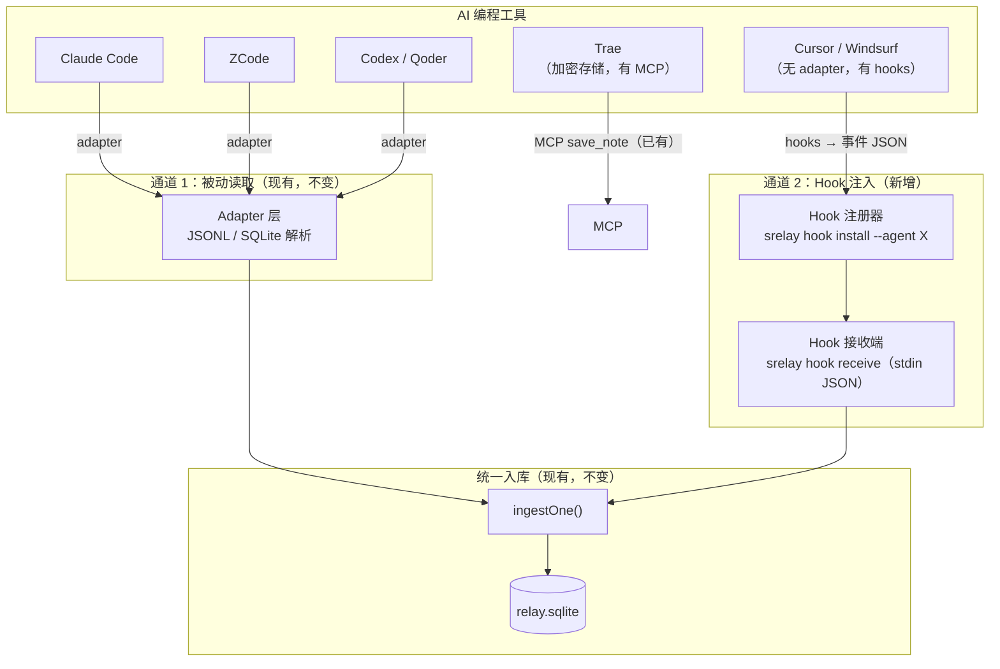

# 双通道捕获架构 — 混合方案 v0.1

> **日期**：2026-08-29
> **状态**：草案（三轮评审中：产品 → 技术架构 → 软件设计）
> **触发来源**：用户提出"能找到 adapter 就被动读取，找不到的用 hook 组合"
> **参考**：Memorix（AVIDS2/memorix）的 hooks 机制逆向分析

---

## 一、要解决什么问题

### 1.1 当前架构的覆盖缺口

| AI 工具 | 被动读取（adapter） | 用户实际覆盖 |
|---------|--------------------|------------|
| Claude Code | ✅ JSONL | ✅ 完整 |
| ZCode | ✅ SQLite | ✅ 完整 |
| Codex | ✅ JSONL | ✅ 完整 |
| Qoder | ✅ JSONL | ✅ 完整 |
| Trae | ⚠️ 部分（仅用户提问，AI 回复加密） | ❌ 半截信息 |
| Cursor / Windsurf / Gemini CLI / 通义灵码 / DSH | ❌ 未写 adapter | ❌ 空白 |
| 任何 MCP 客户端 | ⚠️ 仅查询 + 显式 save_note | ❌ 对话正文空白 |

**问题的本质**：被动读取的覆盖率 = 我们写了多少 adapter。每写一个要逆向格式 + 维护漂移，**永远追不完市场上的 agent 工具**。

### 1.2 Hook 能补什么

Hook 是 agent 官方暴露的事件通道——agent 在对话过程中**主动调用**注册进来的钩子。好处：
- **不需要逆向存储格式**——agent 自己把数据递过来
- **天然覆盖 agent 改版**——只要 hook 接口不变，存储随便改
- **能覆盖加密存储的 agent**（如 Trae）——数据从 agent 内部递出，不经过磁盘文件

代价：
- 需要**逐 agent 配置**（hook 注册方式各家不同）
- hook 事件**不含完整 AI 回复**（只有 prompt、tool 事件等）
- **不覆盖没有 hook 机制的 agent**（Cursor 只有 rules 没有 hooks）

### 1.3 双通道的互补性

```
通道 1：被动读取（adapter）         通道 2：Hook 注入
────────────────────────          ────────────────────────
✅ 完整对话原文（逐条消息）           ⚠️ 事件流（prompt/工具/编辑/生命周期）
✅ 装完即回填历史                    ❌ 从安装后开始积累
✅ agent 零配置                     ❌ 需逐 agent 注册 hook
✅ 已适配 5 个工具                   ✅ 理论上任何有 hook 机制的 agent
❌ 覆盖率 = adapter 数量             ✅ 覆盖率 = 有 hook 机制的 agent 数量
❌ 加密存储无解（Trae）               ✅ 数据从 agent 内部递出，绕过加密
```

**组合公式**：
- 有 adapter 的 agent → 被动读取（完整原文 + 历史回填）
- 没有 adapter 但有 hook 的 agent → hook 注入（从安装后开始积累）
- 两者都没有的 agent → MCP 显式记录（save_note，已有能力）

---

## 二、总体架构设计（v0.1 初稿，待三轮评审）



### 2.1 核心设计原则

1. **被动读取永远是首选**——hook 只填空白，不替换已有 adapter
2. **Hook 数据降级存储**——hook 事件不是完整对话，入库时标记 `origin='hook'`，与完整会话区分
3. **双通道去重**——如果某 agent 同时有 adapter 和 hook，以 adapter 为准，hook 事件跳过
4. **注册即配置**——`srelay hook install --agent cursor` 一条命令完成 hook 注册
5. **Hook 是锦上添花，不是必需**——不装 hook 不影响任何现有功能

---

## 三、第一轮评审：产品视角

### 3.1 评审结论

**方向正确，但四个产品级问题必须在实施前回答：**

#### 问题 P1：Hook 事件的价值密度够吗？

| 数据类型 | 完整原文 | Hook 事件 | 差距 |
|---------|---------|----------|------|
| 用户提问 | ✅ 逐字 | ✅ prompt 事件有 | 小 |
| **AI 回复** | ✅ 逐字 | ❌ **没有**（hook 不上报回复文本） | **致命** |
| 文件编辑 | ✅ 在对话中提及 | ✅ tool 事件有 | 中 |
| 决策 | ✅ 提取器从原文提取 | ⚠️ 需从事件流推断 | 大 |

**关键缺口：AI 回复不在 hook 事件里。** 这意味着 hook 通道的记忆是**半截的**——知道用户问了什么、做了什么操作，但不知道 AI 当时怎么回答的。

**产品裁决**：hook 通道的记忆价值定位为**"活动线索"而非"完整记忆"**——它帮你找到"哪次会话讨论了 X"，然后通过 `sourceFile` 链接回 agent 的原始存储查看全文（如果 agent 支持导出）。**不能承诺与 adapter 同等的检索质量**。

#### 问题 P2：用户会不会混淆两种来源？

`search_sessions` 返回的结果可能一半来自 adapter（完整）、一半来自 hook（事件流）——**AI 无法区分质量差异**，可能基于事件流做自信回答。

**产品裁决**：出处块增加 `completeness` 字段（`full` / `events`），AI 和用户都能识别这是完整对话还是事件线索。搜索结果排序时完整会话优先。

#### 问题 P3：Hook 安装的侵入性

`memorix hooks install` 会修改 agent 的配置文件（如 Claude Code 的插件包）。用户可能不愿意第三方工具改自己的 agent 配置。

**产品裁决**：
- Hook 安装必须**显式 opt-in**（`srelay hook install --agent cursor`），绝不默认
- 安装前列出将修改的文件
- 提供 `srelay hook uninstall --agent cursor` 一键干净卸载
- **不在 init 向导中推荐 hook**——只有 doctor 检测到"有 agent 但没 adapter 覆盖"时才提示

#### 问题 P4：Trae 场景的期望管理

用户最关心的 Trae 加密问题，hook 能解决多少？

**现实核查**：Trae 的 MCP 支持（Memorix 验证过）走 `save_note` 路线——**这不需要 hook，我们已经有了**。Trae 的 hook 机制未知（可能没有）。

**产品裁决**：**Trae 场景的解法是 MCP 主动记录（已实现），不是 hook。** 方案中 Trae 不走 hook 通道，走已有的 MCP save_note + 手册引导。

### 3.2 产品评审后的范围修正

| 原设想 | 修正后 | 理由 |
|--------|--------|------|
| Hook 覆盖 Cursor/Windsurf/Gemini 等 | ✅ 保留，但定位为"活动线索" | AI 回复缺失，不能承诺完整记忆 |
| Hook 解决 Trae 加密 | ❌ 改为 MCP save_note 引导 | Trae hook 机制未知，MCP 已验证可行 |
| `srelay hook install` 改 agent 配置 | ✅ 保留，但 opt-in + 透明 | 用户信任 |
| Hook 事件与 adapter 同等检索 | ❌ 增加 completeness 字段区分 | 诚实标注质量差异 |

---

## 四、第二轮评审：技术架构视角（待续）

（评审中……）

---

## 五、第三轮评审：软件设计视角（待续）

（评审中……）
