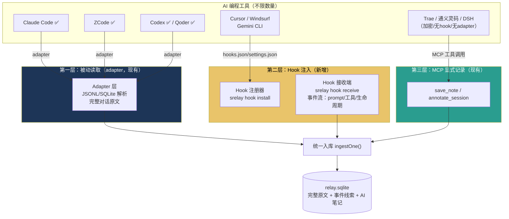

# 双通道捕获架构 — 混合方案 v1.0（三轮评审定稿）

> **日期**：2026-08-29
> **状态**：三轮评审完毕，待用户确认后实施
> **评审轮次**：①产品 ②技术架构 ③软件设计

---

## 一、方案总览

### 1.1 一句话

> **有 adapter 的 agent 被动读取（完整原文），没有 adapter 但有 hook 的 agent 主动注入（事件线索），两者都没有的 agent 走 MCP 显式记录——三层捕获网覆盖市场上所有 AI 编程工具。**

### 1.2 三层捕获网



### 1.3 三层对比

| | 第一层：Adapter | 第二层：Hook | 第三层：MCP 显式 |
|--|---------------|-------------|-----------------|
| 数据类型 | 完整对话原文 | 事件流（prompt/工具/生命周期） | AI 主动记录的结论 |
| AI 回复 | ✅ 逐字 | ❌ 不在事件里 | ⚠️ AI 自己决定记什么 |
| 历史回填 | ✅ 装完即回填 | ❌ 从安装后开始 | ❌ 从使用后开始 |
| Agent 配置 | 零（adapter 自动发现） | 一次 hook install | 一次 MCP 注册 |
| 数据质量标记 | `completeness: full` | `completeness: events` | `completeness: explicit` |
| 已覆盖 | Claude Code / ZCode / Codex / Qoder | Cursor / Windsurf / Gemini CLI（调研确认有 hooks） | 任何 MCP 客户端 |
| 待覆盖 | Trae（加密）、DSH、通义灵码 | 有 hook 的所有 agent | — |

---

## 二、第一轮评审：产品视角

### 裁决结果

| 问题 | 裁决 | 理由 |
|------|------|------|
| Hook 事件的价值定位 | **活动线索**，不是完整记忆 | AI 回复不在 hook 事件里，搜索结果必须标注质量差异 |
| 来源质量区分 | 出处块加 `completeness` 字段 | AI 和用户都能识别是完整对话还是事件线索 |
| Hook 安装侵入性 | **显式 opt-in**，不在 init 推荐 | 用户信任：绝不默认修改 agent 配置 |
| Trae 加密 | 走 MCP save_note（已有能力），**不走 hook** | Trae hook 机制未知，MCP 已验证可行 |
| 搜索排序 | completeness:full 优先于 events | 保证 AI 优先看到高质量数据 |

---

## 三、第二轮评审：技术架构视角

### 3.1 各 Agent Hook 机制调研结果

| Agent | Hook 机制 | 事件类型 | 注册方式 | 数据格式 |
|-------|----------|---------|---------|---------|
| **Claude Code** | `~/.claude/settings.json` 的 hooks 节点 | UserPromptSubmit, PostToolUse, SessionEnd, Stop... | JSON 配置 | stdin JSON（已验证，我们已有 `srelay hook` 命令） |
| **Cursor** | `hooks.json`（项目/用户级） | beforeSubmitPrompt, afterAgentResponse, afterFileEdit, postToolUse, sessionStart, sessionEnd, stop | JSON 文件 | stdio JSON 双向通信 |
| **Windsurf** | `~/.codeium/windsurf/hooks/` | pre_run_command 等生命周期事件 | hooks 目录脚本 | 事件驱动 |
| **Gemini CLI** | `settings.json` 的 hooks 节点 | BeforeTool, AfterTool, SessionStart（regex/exact matcher） | JSON 配置 | stdin JSON（Claude Code 风格） |
| **Trae** | **无已知 hook 机制** | — | — | 走 MCP save_note |
| **通义灵码 / DSH** | 待调研 | — | — | — |

### 3.2 统一 Hook 事件模型

各 agent 的 hook 事件格式不同，需要归一化：

```typescript
// 统一 Hook 事件（所有 agent 归一化到这个结构）
interface HookEvent {
  agent: string;          // 'claude-code' | 'cursor' | 'windsurf' | 'gemini-cli' | ...
  eventType: string;      // 归一化：'prompt' | 'file_edit' | 'session_end' | 'compaction' | ...
  timestamp: string;      // ISO 8601
  projectRoot: string;    // 从 hook 载荷的 cwd 字段提取
  sessionId: string;      // agent 的会话标识（各 agent 字段名不同，adapter 映射）
  payload: {
    prompt?: string;      // prompt 事件
    toolName?: string;    // tool 事件
    filePath?: string;    // file_edit 事件
    compactionSummary?: string; // compaction 事件（Claude Code 已验证有）
  };
}
```

### 3.3 去重策略

**核心问题**：同一个 Claude Code 会话，adapter 在读 JSONL 文件，hook 同时在上报事件——会不会产生两条记录？

**裁决：按 (source, sourceSessionId) 去重，adapter 优先。**

```
入库流程：
  hook 事件到达 → 查 sessions 表有没有 (source, sourceSessionId) 且 origin IN ('auto','manual')
    → 有 → 跳过（adapter 在覆盖这个 agent，hook 事件是冗余的）
    → 没有 → 检查是否有 origin='hook' 的同名会话
        → 有 → 追加事件到该会话
        → 没有 → 新建 origin='hook' 的会话行

adapter 首次覆盖某 agent 时：
  → 清除该 agent 所有 origin='hook' 的会话（被完整数据替代）
```

### 3.4 Hook 接收端设计

**不需要常驻进程**——hook 是 agent 调用 CLI 的方式（与已有的 `srelay hook session-end` 相同模式）：

```
agent 触发 hook → spawn `srelay hook receive`（stdin JSON）→ 写入 spool → 退出
守护 watch 的下一个周期消费 spool → 入库
```

这**复用现有的 hook-spool 机制**（R4 已实现），只需扩展事件类型。

### 3.5 数据量估算

Hook 事件远小于完整消息（无 AI 回复正文）：

| 事件类型 | 每条大小 | 一场 200 条对话 |
|---------|---------|---------------|
| prompt | ~200B | 100 条 × 200B = 20KB |
| file_edit | ~100B | 50 条 × 100B = 5KB |
| session_end | ~50B | 1 × 50B |
| **合计** | | **~25KB / 会话** |

vs adapter 的完整原文 ~1MB / 会话。Hook 通道的存储开销可忽略。

### 3.6 架构风险与缓解

| 风险 | 等级 | 缓解 |
|------|------|------|
| Hook 事件格式随 agent 版本变化 | 🟡 | 归一化层隔离，格式变更只改映射函数 |
| agent 没有预期的 hook 事件 | 🟢 | 优雅降级：没有 compaction 事件就拿不到压缩摘要 |
| 同一 agent 的 adapter + hook 并发写入 | 🟡 | 去重策略（§3.3）+ 短暂写锁 |
| Hook 安装破坏 agent 配置 | 🟡 | opt-in + 安装前备份 + uninstall 干净还原 |
| Cursor hooks 还在 beta（2025.10 引入） | 🟡 | v1 先支持 Claude Code + Gemini CLI（hooks 更成熟），Cursor 在 v1.1 |
| Windsurf 的 hooks 文档不完整 | 🟡 | v1 不覆盖，v1.1 补 |

---

## 四、第三轮评审：软件设计视角

### 4.1 新增文件

```
src/
├── capture/
│   ├── hook-receive.ts      # srelay hook receive：stdin JSON → 归一化 → spool
│   ├── hook-install.ts      # srelay hook install/uninstall：各 agent 的 hook 注册
│   └── hook-events.ts       # 统一 HookEvent 模型 + 归一化映射
├── capture/
│   └── sync.ts              # 修改：ingestOne 处理 origin='hook' 的去重逻辑
```

### 4.2 Hook 安装器（per-agent 注册模板）

```typescript
// capture/hook-install.ts
interface HookInstaller {
  agent: string;
  /** 返回将修改的文件列表（安装前展示给用户） */
  preview(): { file: string; action: 'create' | 'modify' }[];
  /** 注册 hook（写入 agent 的 hook 配置） */
  install(projectRoot: string): void;
  /** 卸载（干净还原） */
  uninstall(projectRoot: string): void;
  /** 检查是否已安装 */
  isInstalled(): boolean;
}

// Claude Code 的实现（我们最熟悉的）
const claudeCodeInstaller: HookInstaller = {
  agent: 'claude-code',
  preview() {
    return [{ file: '~/.claude/settings.json', action: 'modify' }];
  },
  install(root) {
    // 在 settings.json 的 hooks 节点添加：
    // UserPromptSubmit → srelay hook receive --agent claude-code
    // SessionEnd → srelay hook session-end --id $CLAUDE_SESSION_ID
    // PostToolUse → srelay hook receive --agent claude-code
  },
  uninstall(root) { /* 移除我们添加的 hook 条目 */ },
  isInstalled() { /* 检查 settings.json 中是否有 srelay hook */ },
};
```

### 4.3 Hook 接收端（扩展现有 hook-spool）

```typescript
// capture/hook-receive.ts
// stdin JSON → 归一化 HookEvent → 写入 spool JSON 文件
export function receiveHookEvent(agent: string, stdinJson: string): void {
  const raw = JSON.parse(stdinJson);
  const event = normalizeHookEvent(agent, raw);  // 各 agent 的字段映射
  writeSpool(root, event);  // .sessionrelay/events/ 目录（复用 R4 的 spool）
}

// 归一化映射表
const NORMALIZERS: Record<string, (raw: any) => HookEvent> = {
  'claude-code': (raw) => ({
    agent: 'claude-code',
    eventType: normalizeClaudeEvent(raw.hook_event_name),  // UserPromptSubmit → prompt
    timestamp: new Date().toISOString(),
    projectRoot: raw.cwd ?? '',
    sessionId: raw.session_id ?? '',
    payload: { prompt: raw.prompt, toolName: raw.tool_name },
  }),
  'cursor': (raw) => ({ /* hooks.json 的 JSON 载荷映射 */ }),
  'gemini-cli': (raw) => ({ /* settings.json 的 JSON 载荷映射 */ }),
};
```

### 4.4 sync.ts 修改（hook 事件入库）

```typescript
// ingestOne 扩展：处理 origin='hook' 的事件批次
// 1. 去重：检查是否有 adapter 覆盖的同身份会话
// 2. 事件按 sessionId 分组 → 每个 sessionId 一条 origin='hook' 的 sessions 行
// 3. 消息以 system 角色入库：content = JSON.stringify(hookEvent)
// 4. completeness = 'events'

// sync 完成后：adapter 覆盖某 agent 时清除该 agent 的 hook 会话
```

### 4.5 SearchHit 扩展

```typescript
interface SearchHit {
  // ... 现有字段
  completeness: 'full' | 'events' | 'explicit';  // 🆕
}
// 排序：full 优先于 events（同 score 时）
```

### 4.6 CLI 命令

```bash
# 安装 hook（显式 opt-in）
srelay hook install --agent claude-code    # 我们最熟的（v1 首发）
srelay hook install --agent gemini-cli     # v1 首发有文档的
srelay hook install --agent cursor         # v1.1（hooks 还在 beta）

# 预览（安装前列出将修改的文件）
srelay hook install --agent cursor --dry-run

# 卸载
srelay hook uninstall --agent claude-code

# 查看状态
srelay hook status

# 接收端（agent 的 hook 调用，用户不直接使用）
srelay hook receive --agent cursor        # stdin JSON → spool
```

### 4.7 实施计划

| 阶段 | 内容 | 说明 |
|------|------|------|
| **v1（本期）** | 统一 HookEvent 模型 + Claude Code + Gemini CLI 的 installer/receiver + 去重逻辑 + completeness 字段 | 只做有完整文档、hooks 成熟的 agent |
| **v1.1** | Cursor hooks（beta 验证后）+ Windsurf（文档补全后） | 需要更多调研 |
| **v2** | Hook 事件的元数据提取（决策/话题从事件流推断） | 依赖 v1 的数据积累 |
| **不在计划内** | Trae hook（无 hook 机制）、通义灵码/DSH hook（待调研） | 走 MCP save_note 路线 |

### 4.8 测试计划

| 层 | 测试项 |
|----|--------|
| 单元 | 归一化映射（各 agent → HookEvent）/ 去重逻辑 / completeness 排序 |
| 集成 | hook install → install → agent 模拟 hook 调用 → spool → sync 入库 → search 命中（completeness: events） |
| 去重 | adapter 先入库 → hook 事件到达 → 跳过 / hook 先入库 → adapter 覆盖 → hook 会话清除 |
| 安全 | hook install 前预览 / uninstall 干净还原 / 不修改无关配置 |
| 端到端 | Cursor 安装 hook → 对话 → 事件入库 → 搜索 → 出处含 completeness:events |

---

## 五、最终结论

### 是否可行：**可行，但范围需要收紧**

| 原设想 | 评审后 | 原因 |
|--------|--------|------|
| Hook 覆盖所有 agent | **v1 只做 Claude Code + Gemini CLI** | 只有这两家有完整文档且 hooks 成熟；Cursor 还在 beta；Windsurf 文档不完整 |
| Hook 替代 adapter | **Hook 永远是补充，不替代 adapter** | AI 回复缺失，定位为活动线索 |
| Hook 解决 Trae | **Trae 走 MCP save_note** | Trae 没有 hook 机制 |
| Hook 事件与 adapter 同等检索 | **completeness 字段区分，full 优先** | 诚实标注质量 |

### 实施的三个前提

1. 用户确认方案（本文档）
2. Phase 0 门槛制：先写 Claude Code + Gemini CLI 的 hook install/receive 原型，验证事件捕获→入库→检索全链路（约 1 天）
3. v1 只交付两个 agent 的 hook 适配，验证后再扩展

### 最终收益

| 用户场景 | 之前 | 之后 |
|---------|------|------|
| Claude Code 用户 | adapter 完整捕获 | 不变（adapter 优先，hook 冗余被跳过） |
| Cursor 用户 | ❌ 完全不支持 | ✅ 事件级记忆（知道聊了什么、编辑了什么文件） |
| Gemini CLI 用户 | ❌ 完全不支持 | ✅ 事件级记忆 |
| Trae 用户 | ⚠️ 仅用户提问 | 不变（MCP save_note 补充，手册引导） |
| 任何 MCP 客户端 | ⚠️ 仅 save_note | 不变 |

** Hook 是锦上添花，不是雪中送炭——它把"完全不支持"提升为"事件级支持"，但不会把"事件级"变成"完整级"。**
