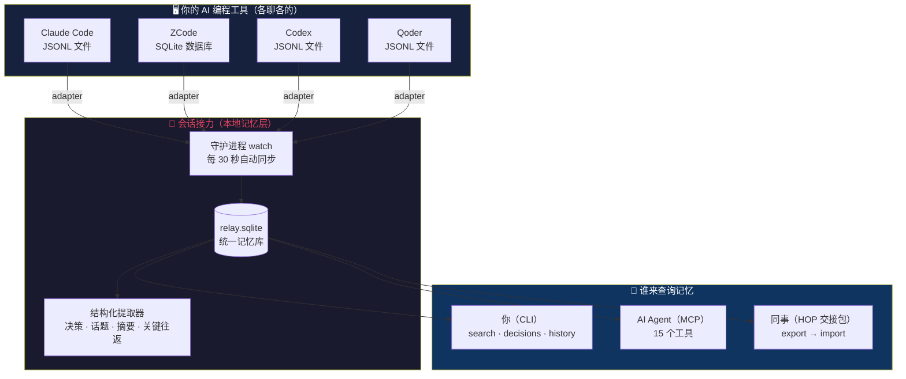
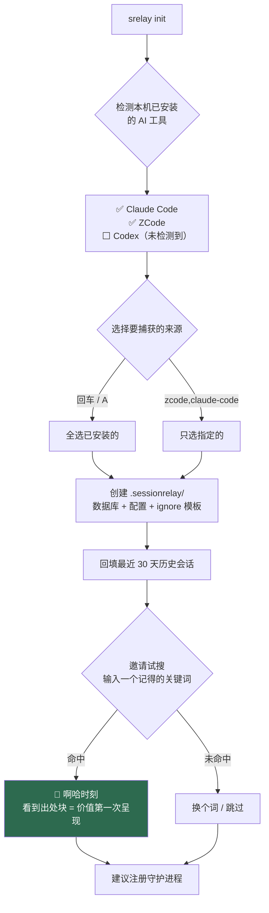
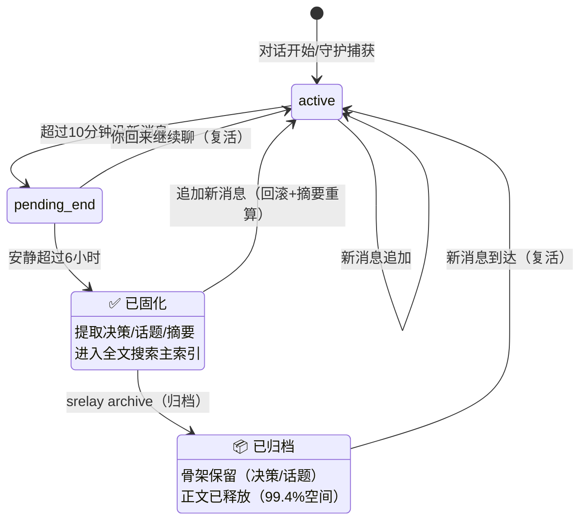
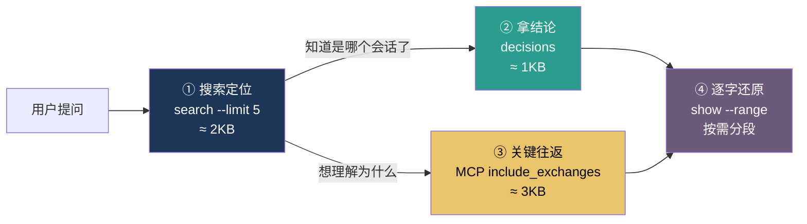
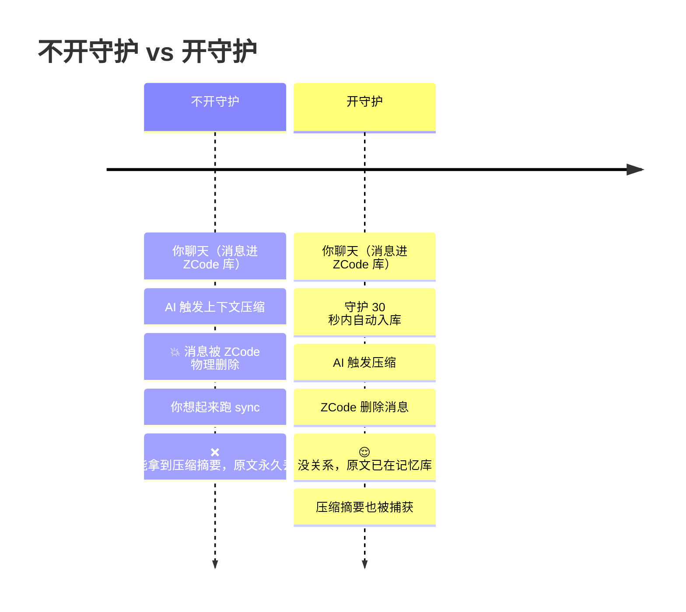
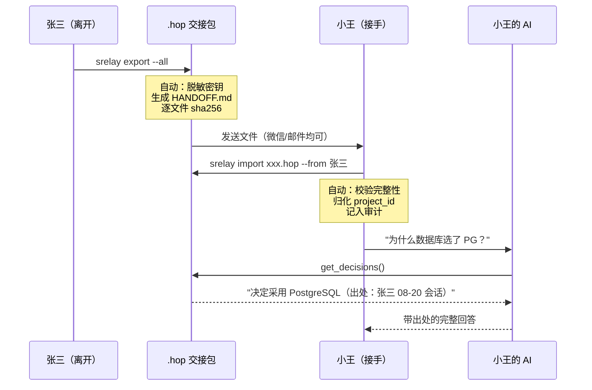
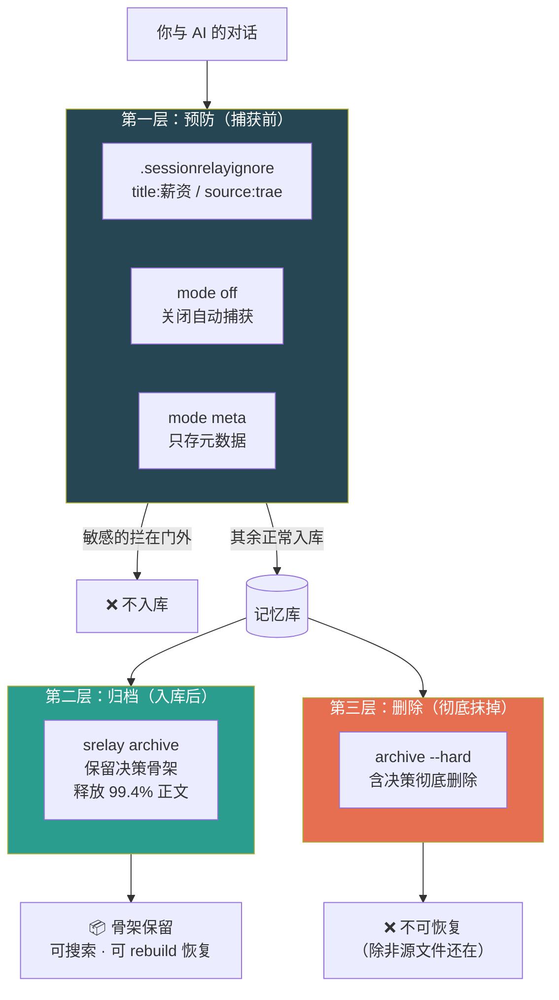

# 会话接力 SessionRelay — 用户手册

> **属于项目、不属于任何厂商的本地记忆层。**
> 本手册面向所有用户——从第一次安装到高级配置，全程图文引导。

---

## 全景：这个工具在做什么



**一句话**：你和任何 AI 工具聊的内容，被统一收进一个项目级数据库；你、AI、同事都能查；换工具不丢记忆，换人可交接。

---

## 目录

1. [安装](#一安装)
2. [初始化项目](#二初始化项目)
3. [记忆的生命周期](#三记忆的生命周期)
4. [日常使用](#四日常使用)
5. [搜索：找回任何一段讨论](#五搜索)
6. [守护进程](#六守护进程)
7. [AI Agent 接入（MCP）](#七ai-agent-接入mcp)
8. [团队交接](#八团队交接)
9. [归档与数据生命周期](#九归档与数据生命周期)
10. [隐私控制](#十隐私控制)
11. [自定义适配器](#十一自定义适配器)
12. [常见问题](#十二常见问题)
13. [快速参考卡](#十三快速参考卡)

---

## 一、安装

### 要求

- **Node.js ≥ 22**（Windows / macOS / Linux）
- 至少一个支持的 AI 编程工具

### 从源码安装

```bash
git clone https://github.com/EwanJasper/SessionRelay.git
cd SessionRelay
npm install
npm run build
npm link          # 之后全局可用 srelay 命令
```

### 验证

```bash
srelay --version   # 0.1.0
srelay doctor      # 14 项环境自检
```

doctor 检查项：Node 版本 · FTS5 可用 · 中文分词 · 五个 AI 工具的源目录 · config · 数据库完整性 · 归档表 · 自定义适配器 · 守护进程。任何 ❌ 都带修复建议。

---

## 二、初始化项目

```bash
cd /你的项目
srelay init
```

### 初始化流程



### 来源选择

| 方式 | 命令 | 场景 |
|------|------|------|
| 交互勾选 | `srelay init` | 首次使用（推荐） |
| 指定来源 | `srelay init --sources zcode,claude-code` | 明确知道要什么 |
| 自动全选 | `srelay init --yes` | 脚本/CI 环境 |

**跨平台检测**：Claude Code / ZCode / Codex / Qoder 的家目录结构三平台一致；Trae 按平台分别检测（Windows `AppData/Roaming`、macOS `Library/Application Support`、Linux `.config`）。

**已安装但没检测到？** 两条出路：
1. 编辑 `.sessionrelay/config.json` 的 `capture.sources`
2. 设置环境变量覆盖路径（`CODEX_DIR` / `ZCODE_DB_PATH` / `CLAUDE_PROJECTS_DIR`）

---

## 三、记忆的生命周期

理解这个流程，你就理解了产品的核心机制：



**为什么需要中间的 pending 状态**：ZCode 的对话可以复活（第二天 --resume 继续）。如果直接固化，提取的决策就是残缺的。pending 是 6 小时缓冲带——**宁可多等，不固化没聊完的对话**。

**消息在哪一层**：

| 状态 | 你问"为什么选 PG" | 检索质量 |
|------|------------------|---------|
| confirmed | 决策 + 原文 + 关键往返全可查 | 完整 |
| archived | 决策 + 话题 + 摘要（正文已释放） | 骨架完整 |

---

## 四、日常使用

### 查看记忆库

```bash
srelay status             # 总览面板
srelay list               # 列出所有会话
srelay list --source zcode     # 只看 ZCode 的
srelay list --source note      # 只看 AI 笔记
```

status 面板示例：

```
会话接力 · myapp   模式: full
──────────────────────────────────────────
守护    ● running (pid 1234) · 服务: 已注册
会话    active 1 · pending 0 · confirmed 2 + 1 条 AI 笔记
来源    zcode 2
拦截    ignore 规则累计拦截 0 次
体积    relay.sqlite 1.8 MB
最近
   08-29 09:44  zcode  「深入理解会话接力产品需求」 active
```

### 查看对话内容

```bash
srelay show <ID前缀>              # 全部消息（20KB 预算保护）
srelay show <ID> --range 10:20    # 只看第 10-20 条
```

### 手动保存

```bash
srelay save <ID>                          # 手动保存（origin=manual）
srelay save --recent 7d                   # 保存最近 7 天
srelay save --interactive                 # 交互勾选
srelay save <ID> --tag "重要" --summary "定了JWT"  # 附加标签
```

---

## 五、搜索

### 三种深度，按需选择



**省 token 的原则**：先用便宜的查询定位，再按需深入。大部分问题在①②就能回答。

### 搜索命令

```bash
srelay search "数据库索引"                # 中文全文
srelay search "认证" --source zcode       # 按来源过滤
srelay search "部署" --since 2026-08-01   # 按时间过滤
srelay search "JWT" --json               # 机器输出
```

**每条结果都带出处**：来源 agent、日期、会话 ID、消息序号——随时 `srelay show <id>` 跳回原文核验。这是产品的反幻觉承诺：AI 说的每句话都可追溯。

### 决策与未决问题

```bash
srelay decisions                # 全部已确认决策（带出处）
srelay decisions --topic "数据库" # 按话题过滤
srelay unresolved               # 讨论过但没定论的
srelay history src/db/schema.sql # 某文件的跨会话讨论史
```

---

## 六、守护进程

### 为什么必须有

**ZCode 在上下文压缩时会物理删除旧消息**（实测：一个 500 条会话压缩后被删 3976 条）。守护每 30 秒同步，确保消息在被删之前入库。



### 安装

```bash
srelay watch --install-service   # Windows 注册表自启动（无需管理员）
srelay watch --foreground        # macOS/Linux 前台运行
```

### 资源开销（实测）

| 资源 | 消耗 |
|------|------|
| CPU | 空闲 ≈ 0%，事件驱动 |
| 内存 | ~80MB 稳定 |
| 网络 | **零外呼** |
| 磁盘 | 增量极低 |

### 懒启动

任何 `srelay` 命令执行时、MCP serve 启动时——守护不在就自动拉起。**你永远不需要想"守护在不在"**。

---

## 七、AI Agent 接入（MCP）

### 接入方式

```bash
# Claude Code（一条命令）
claude mcp add sessionrelay --scope user -- srelay serve

# 其他 MCP 客户端（JSON 配置）
```

```json
{
  "mcpServers": {
    "sessionrelay": { "command": "srelay", "args": ["serve"] }
  }
}
```

### AI 什么时候会调用记忆？

AI 依据**工具描述**和**响应提示**决策。推荐把下面这段加进你 agent 的 CLAUDE.md / AGENTS.md（复制即用）：

```markdown
## 项目记忆（sessionrelay MCP）

本项目接入了会话接力记忆库。处理任务时遵循以下规则：

1. **开始新任务前**：先调用 `get_stats` 了解记忆库规模；
   涉及既有模块时用 `search_sessions` 查相关历史。
2. **用户问"之前/上次/为什么当时"**：必须查记忆，
   优先 `get_decisions`（结论）→ `get_session_detail(include_exchanges:true)`（推导过程）。
3. **实现前**：确认是否已有相关决策，避免推翻已定的方案。
4. **引用记忆时**：必须说明出处（"根据 8 月 20 日在 ZCode 中的讨论"）。
5. **得出重要结论时**：调用 `save_note` 记入记忆，供后续会话使用。
6. **省 token**：先 search 定位 → 再按需深入。响应里有 estimated_tokens 和 hint 跟随引导。
```

### 15 个工具速览

<details>
<summary><b>读工具（8 个）</b></summary>

| 工具 | 何时用 |
|------|--------|
| `search_sessions` | 找相关历史讨论（出处块强制） |
| `get_session_detail` | 查看对话内容（role 过滤 / 分页 / 20KB 预算） |
| `list_sessions` | 浏览所有会话 |
| `get_decisions` | 拿全部技术决策 |
| `get_file_history` | 某文件的跨会话讨论史 |
| `get_unresolved` | 未决问题清单 |
| `get_stats` | 记忆库规模 |
| `set_scope` | 检索边界逃生口 |

</details>

<details>
<summary><b>写域工具（7 个）</b></summary>

| 工具 | 能力 | 边界 |
|------|------|------|
| `annotate_session` | 打标签/写摘要 | 只改元数据 |
| `save_note` | 结论入记忆 | 可识别可审计 |
| `export_handoff` | 导出交接包 | 只读 |
| `import_handoff` | 导入交接包 | 默认隔离 |
| `release_quarantine` | 放行隔离正文 | 显式调用 |
| `link_sessions` | 建立会话关联 | 可撤销 |
| `get_linked_sessions` | 查询关联 | 只读 |

</details>

---

## 八、团队交接

### 交接流程



### 五个真实场景

> 完整命令见[导入导出实操指南](import-export-guide.md)

| 场景 | 关键命令 |
|------|---------|
| 项目交接 | `export --all` → `import` |
| 新人入职 | `export --decisions-only`（轻量包）|
| 不信任来源 | `import --quarantine` → 审查 → `release` |
| 项目搬迁 | 旧路径 export → 新路径 import |
| 定期归档 | `export --all --output backup/月度.hop` |

---

## 九、归档与数据生命周期

### 什么时候归档

| 库大小 | 使用时长 | 建议 |
|--------|---------|------|
| < 100MB | < 1 年 | 不需要 |
| 100-500MB | 1-3 年 | 归档半年前的 |
| 500MB+ | 3 年+ | 归档 + 考虑 `--hard` 清理无关内容 |

### 归档操作

```bash
srelay archive --days 90 --dry-run    # 先预览
srelay archive --days 90              # 执行（决策保留，正文释放 99.4%）
srelay archive --days 90 --hard       # 彻底删除（含决策）
srelay archive --history              # 查看归档审计
srelay archive --history --verbose    # 逐会话明细
```

### 保护规则（这些永远不被归档）

- 正在进行的对话（active）
- 交接包导入的（imported）——源文件不在本机，删了真没了
- AI 笔记（note）
- 标签含"保留"的

### 恢复

```bash
srelay rebuild --force    # 从源文件重建（归档/删除的数据恢复）
```

---

## 十、隐私控制

### 三层防线



| 层 | 时机 | 决策 | 可恢复 | 审计 |
|---|------|------|--------|------|
| 预防 | 捕获前 | 没入库 | — | — |
| 归档 | 入库后 | ✅ 保留 | rebuild --force | cleanup_log |
| 删除 | 入库后 | ❌ 删除 | 需源文件 | cleanup_log |

---

## 十一、自定义适配器

新 AI 工具 = 一个 JS 文件，零改核心：

```
.sessionrelay/adapters/my-agent.js
```

```javascript
module.exports = {
  id: 'my-agent',
  displayName: 'My Agent',
  discover(projectRoot, config) {
    return [{ source: 'my-agent', sourceSessionId: 'x1',
              sourceFile: '/path/to/session', sizeBytes: 1024, mtimeMs: Date.now() }];
  },
  async readNew(ds, cursor, config) {
    return { messages: [{ role: 'user', content: '...', seqNum: 1 }],
             badLines: 0, cursor: {} };
  },
};
```

> 完整接口与水位契约：[Adapter SDK](adapters/README.md)

---

## 十二、常见问题

<details>
<summary><b>多次 init 会怎样？</b></summary>

安全。检测到已初始化后只做增量同步，幂等设计保证不产生重复。
</details>

<details>
<summary><b>导入别人的会话会和我自己的冲突吗？</b></summary>

不会。会话身份是 (来源, 会话ID)，不同用户的 UUID 永远不同。同一包导入两次会幂等跳过。
</details>

<details>
<summary><b>ZCode 压缩上下文后消息丢了？</b></summary>

开守护（30 秒窗口）。已丢的不可恢复（源文件被 ZCode 删了），但压缩摘要会被捕获。
</details>

<details>
<summary><b>数据会上传吗？</b></summary>

不会。零网络外呼，遥测仅为本地计数器（<code>srelay stats</code>）。
</details>

<details>
<summary><b>AI 什么时候该查记忆 vs 用自己的上下文？</b></summary>

当前对话刚说的 → 用上下文；涉及"之前/历史/为什么当时" → 查 MCP。手册第七章有可复制进 CLAUDE.md 的引导文案。
</details>

<details>
<summary><b>搜索结果太多会不会撑爆 AI 上下文？</b></summary>

不会。三层护栏：搜索只返回摘要（2KB）、detail 默认 20 条×1000 字+50KB 硬顶、响应带 estimated_tokens 让 AI 感知消耗。
</details>

---

## 十三、快速参考卡

```bash
# ═══ 初始化 ═══
srelay init                              # 交互式初始化
srelay init --sources zcode,claude-code  # 指定来源
srelay sync --backfill all               # 全量回填

# ═══ 查询 ═══
srelay search <关键词>                    # 中文搜索
srelay decisions [--topic T]             # 决策列表
srelay unresolved                        # 未决问题
srelay history <文件路径>                 # 文件讨论史
srelay list [--source S] [--json]        # 列出会话
srelay show <ID> [--range a:b]           # 查看对话
srelay status [--json]                   # 总览面板
srelay doctor                            # 环境自检

# ═══ 守护 ═══
srelay watch --install-service           # 注册自启动
srelay watch --status                    # 状态检查

# ═══ 交接 ═══
srelay export --all                      # 导出交接包
srelay export --format markdown          # HANDOFF.md
srelay import <file>.hop --from 名字     # 导入
srelay team status                       # 贡献统计

# ═══ 归档 ═══
srelay archive --days 90 --dry-run       # 预览
srelay archive --days 90                 # 归档
srelay archive --history --verbose       # 审计历史
srelay rebuild --force                   # 从源恢复

# ═══ 隐私 ═══
srelay mode <full|meta|off>              # 捕获模式
# .sessionrelayignore                    # 排除规则
```

---

*相关文档：[导入导出指南](import-export-guide.md) · [Adapter SDK](adapters/README.md) · [HOP 协议规格](../spec/hop-1.0.md) · [隐私与数据生命周期设计](privacy-and-lifecycle-design.md)*
